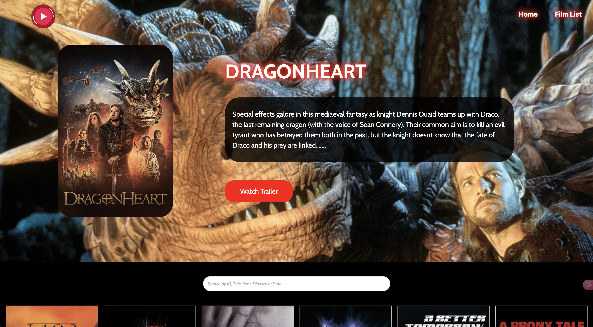
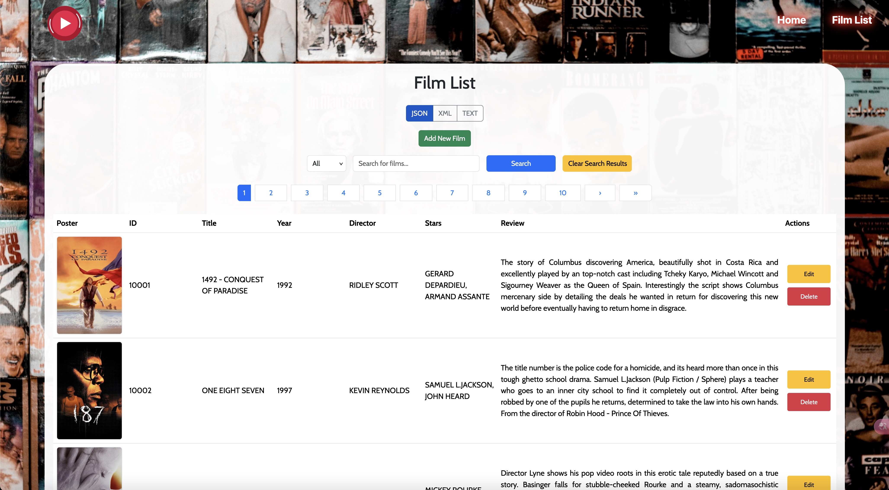

# FilmApp (React Web Application)

## Home Page



## Film List Page



## Project Overview

FilmApp is a React-based web application designed to manage and display a collection of films. The application allows users to perform CRUD (Create, Read, Update, Delete) operations on the film database, enhancing the user experience with features like searching for films, displaying film details, and a dynamic homepage with a hero slider.

## Features

- CRUD Operations: Users can add, edit, delete, and search for films.
- Search Functionality: Users can search films by various attributes such as ID, title, year, director, and stars.
- Dynamic Homepage: The homepage features a hero slider that displays a random selection of movies, along with an AJAX-powered search bar for immediate interaction.
- Pagination: To maintain site responsiveness and manage database query efficiency, the film list page initially displays only 24 films and provides pagination for exploring more films.
- Flexible Data Formats: The application supports various data formats (JSON, XML, TEXT) for displaying film data, ensuring versatility in data handling.

## Technologies Used

- Programming Languages: JavaScript (ES6+)
- Frameworks/Libraries: React.js, Axios, Bootstrap, Lottie
- Development Tools: Vite (for development)
- Backend Integration: RESTful API (FilmRestful) for managing film data
- Database: MySQL (via RESTful API)
- IDE: Visual Studio Code

## Getting Started

### Prerequisites

- Node.js and npm (Node Package Manager)
- TMDb API key

### Installation

1. Clone the repository:

   ```bash
   git clone https://github.com/suatkocar/FilmApp.git
   ```

2. Navigate to the project directory:

   ```bash
   cd FilmApp
   ```

3. Install the dependencies:

   ```bash
   npm install
   ```

4. Create a `.env` file in the root directory and add your TMDb API key:

   ```env
   VITE_TMDB_API_KEY=your_api_key_here
   ```

5. Set up the [FilmRestful](https://github.com/suatkocar/FilmRestful) backend project:

- Follow the instructions in the FilmRestful README to set up the project and configure the database.
- Ensure the FilmRestful project is running and accessible at the provided API URLs in the .env file.

### Development

To start the development server:

```bash
npm run dev
```

The application will be available at `http://localhost:3000`.

### Build

To create a production build:

```bash
npm run build
```

The build output will be in the `dist` directory.

### Proxy Server

To run the proxy server:

```bash
node server.js
```

The proxy server will be available at `http://localhost:5000`.

## Usage

Access the application at `http://localhost:3000`.

## Project Structure

```plaintext
FilmApp
├── dist
│   ├── assets
│   │   ├── audio
│   │   ├── images
│   │   ├── index.css
│   │   ├── index.js
│   │   └── json
│   └── index.html
├── public
│   └── assets
│       ├── audio
│       ├── images
│       └── json
├── screenshots
│   ├── home-page.jpg
│   ├── film-list-page.jpg
├── src
│   ├── api
│   ├── components
│   ├── pages
│   ├── App.css
│   ├── App.jsx
│   ├── main.jsx
│   └── vite.config.js
├── .gitignore
├── package-lock.json
├── package.json
├── server.js
├── index.html
└── README.md
```

## License

This project is licensed under the MIT License - see the [LICENSE.md](LICENSE.md) file for details.

## Contact

For any inquiries, please contact me at suatkocar.dev@gmail.com.